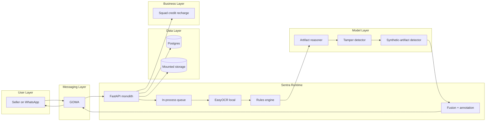
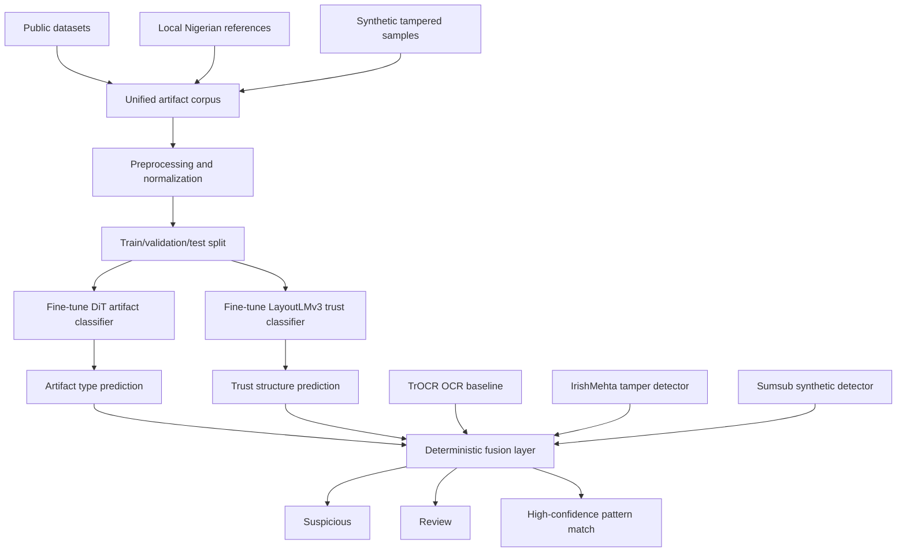
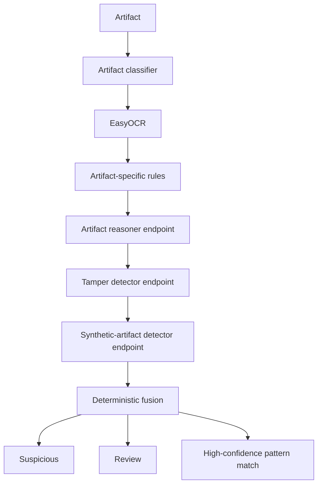
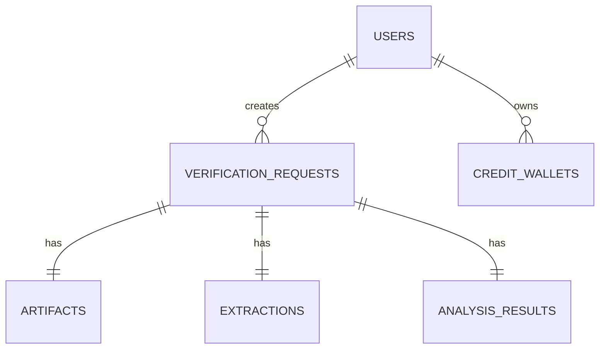

# Sentra

Sentra is a WhatsApp-first fraud risk detector for proof-of-payment artifacts used by small online sellers and Instagram/WhatsApp vendors in Nigeria. It screens bank alert screenshots, SMS alert screenshots, payment receipt screenshots, receipt PDFs, and AI-generated or synthetic proof artifacts before goods are released.

## Why this exists

Challenge 01 requires an AI system that verifies or trust-scores fraud-prone artifacts, produces interpretable outputs, handles forged or incomplete inputs, and integrates Squad meaningfully. Social commerce in Nigeria often closes sales inside chat, where sellers must make release decisions from low-trust screenshots and receipts. Sentra targets that exact failure point.

## Product boundary

- Sentra is a **fraud risk detector**
- Sentra is **not** a bank-settlement verifier
- Sentra does **not** claim a proof is legally genuine or fake
- Sentra returns only:
  - `Suspicious`
  - `Review`
  - `High-confidence pattern match`

## User flow

```mermaid
flowchart LR
  A[Seller sends screenshot or PDF on WhatsApp] --> B[GOWA webhook]
  B --> C[FastAPI ingest]
  C --> D[Persist request + artifact]
  D --> E[In-process worker]
  E --> F[Artifact classification]
  F --> G[EasyOCR + normalized fields]
  G --> H[Rules engine]
  H --> I[Artifact reasoner]
  I --> J[Tamper detector]
  J --> K[Synthetic-artifact detector]
  K --> L[Deterministic fusion]
  L --> M[Annotated preview + action]
  M --> N[GOWA sends result back to seller]
```



## Full architecture

The editable Excalidraw source lives at `assets/diagrams/sentra-system.excalidraw`.



## Runtime architecture

- `FastAPI` orchestrates ingestion, persistence, OCR, rules, fusion, annotation, and messaging
- `GOWA` handles inbound and outbound WhatsApp traffic
- `Postgres` stores users, verification requests, artifacts, extractions, analysis results, and credit wallets
- `Mounted storage` stores uploads, rendered files, and annotated outputs
- `EasyOCR` runs locally
- the reasoning and detector layers run as hosted model services
- `Squad` is used for credit recharge payments

## Input contract

- supported file types:
  - `image/jpeg`
  - `image/png`
  - `application/pdf`
- file size limit:
  - about `10 MB`
- PDF scope:
  - first page only
- multi-file messages:
  - first supported file only
- interaction model:
  - single-turn
  - upload-first
  - no follow-up prompts in WhatsApp

## Output contract

Every response returns:

- verdict
- artifact type
- extracted fields
- top reasons
- recommended action
- annotated preview when available

Example shape:

```json
{
  "request_id": 42,
  "artifact_type": "bank_alert_screenshot",
  "verdict": "Suspicious",
  "recommended_action": "Do not release goods yet. Request another proof or confirm payment through a safer channel.",
  "extracted_fields": {
    "amount": "Not detected",
    "currency": "NGN",
    "date": "Not detected",
    "time": "Not detected",
    "reference": "Not detected",
    "provider": "Not detected",
    "recipient_label": "Not detected"
  },
  "reasons": [
    "The SMS proof is missing a balance-style structural cue.",
    "A clear transaction reference was not detected."
  ],
  "quality_flags": [],
  "annotated_artifact_path": "storage/annotated/42_sample.png",
  "processing_time_ms": 850
}
```

## Verdict semantics

### `Suspicious`

Use when there is strong tamper evidence or severe structural inconsistency.

Recommended action:
- do not release goods yet
- request another proof or confirm through a safer channel

### `Review`

Use when the upload quality is poor, the format is ambiguous, or the system cannot assess confidently.

Recommended action:
- do not rely on this proof alone
- ask for a clearer screenshot or original receipt document

### `High-confidence pattern match`

Use when the artifact matches known proof patterns and no major anomaly signals are found.

Recommended action:
- proceed at your discretion

## ML and pipeline design

The application implements a multi-branch verification pipeline with artifact classification, OCR, structural reasoning, tamper analysis, synthetic-artifact detection, and deterministic fusion.

### Models

- `microsoft/dit-base`
  - artifact classification across bank alert screenshots, SMS alert screenshots, receipt screenshots, and rendered PDF receipts
- `microsoft/layoutlmv3-base`
  - structural trust classification using image, text, and layout signals
- `IrishMehta/fraud-detection-idnet-three-class`
  - tamper and document-fraud classification for manipulated proof artifacts
- `TrOCR`
  - OCR baseline for document and payment-proof text extraction
- `Sumsub/Sumsub-ffs-synthetic-2.0`
  - AI-generated or synthetic proof detection

### Datasets

- `CORD`
  - receipt structure and field layout supervision
- `SROIE`
  - receipt OCR and key information extraction support
- `Find it Again!`
  - forged receipt supervision
- `DocTamper`
  - document tampering supervision
- local anonymized Nigerian proof references
  - bank alert screenshots
  - SMS alert screenshots
  - payment receipt screenshots
  - receipt PDFs rendered to image
- synthetic tampered samples derived from local and public artifacts
  - amount edits
  - date/time edits
  - reference edits
  - compression and crop variants
  - region-level replacements

### Training and fine-tuning pipeline

The model stack is split into fine-tuned task-specific components and pretrained support components.

#### Fine-tuned models

- `microsoft/dit-base`
  - fine-tuned for artifact classification
  - target classes:
    - bank alert screenshot
    - SMS alert screenshot
    - payment receipt screenshot
    - rendered receipt PDF
    - unknown
- `microsoft/layoutlmv3-base`
  - fine-tuned for structural trust classification
  - learns from image, OCR text, and layout structure
  - optimized to separate:
    - manipulated or fraudulent proofs
    - structurally coherent proofs
    - uncertain or degraded proofs that later map to `Review`

#### Pretrained models used without fine-tuning

- `IrishMehta/fraud-detection-idnet-three-class`
  - used as a tamper or manipulated-proof detector
  - contributes fraud-manipulation signal to fusion
- `Sumsub/Sumsub-ffs-synthetic-2.0`
  - used as the synthetic or AI-generated artifact detector
  - contributes synthetic-content signal to fusion
- `TrOCR`
  - used as the OCR baseline for text extraction and field normalization

#### Data assembly strategy

The training corpus is assembled in three layers:

- public supervision layer
  - `CORD`
  - `SROIE`
  - `Find it Again!`
  - `DocTamper`
- local Nigerian reference layer
  - anonymized bank alert screenshots
  - anonymized SMS alert screenshots
  - anonymized payment receipt screenshots
  - anonymized receipt PDFs rendered to image
- synthetic tampering layer
  - amount edits
  - date/time edits
  - reference edits
  - crop and compression variants
  - region replacements
  - forwarding-style degradations

#### Fine-tuning flow



#### Training mechanics

- artifact images are normalized into a common visual format before training
- PDF receipts are rendered to images before entering the corpus
- OCR text is aligned with layout structure for `LayoutLMv3`
- tampered examples are labeled at artifact level, with edited-field metadata when available
- quality-degraded samples are included so the system learns to defer to `Review` rather than overconfidently classify

#### Evaluation

- `DiT` artifact classifier
  - accuracy
  - confusion matrix by artifact type
- `LayoutLMv3` trust classifier
  - precision
  - recall
  - F1 on manipulated vs coherent proofs
- end-to-end verification pipeline
  - verdict correctness on holdout cases
  - OCR key-field extraction coverage
  - latency by artifact type

### Decision logic



## Folder structure

```text
.
├── app
│   ├── api
│   │   └── routes
│   ├── core
│   ├── db
│   ├── inference
│   ├── integrations
│   ├── models
│   ├── schemas
│   ├── services
│   └── workers
├── assets
│   └── diagrams
├── ml
│   ├── datasets
│   ├── evaluation
│   └── training
├── scripts
│   ├── generate_synthetic
│   └── prepare_data
├── storage
│   ├── annotated
│   ├── rendered
│   └── uploads
├── tests
├── docker-compose.yml
├── Dockerfile
├── pyproject.toml
└── README.md
```

## Key modules

### `app/api/routes`

- `health.py`
  - `/health`
  - `/ready`
- `dev.py`
  - internal upload endpoint
  - request result inspection endpoint
- `webhooks.py`
  - GOWA inbound webhook

### `app/inference`

- `artifact_classifier.py`
  - artifact type routing
- `ocr.py`
  - OCR integration
- `quality.py`
  - quality flags
- `rules.py`
  - artifact-specific deterministic checks
- `hosted_runtime.py`
  - hosted model adapters
- `fusion.py`
  - final verdict mapping
- `annotate.py`
  - preview generation
- `pipeline.py`
  - full orchestration path

### `app/integrations`

- `gowa.py`
  - send/receive WhatsApp messages and files
  - GoWA basic-auth + device-ID integration
- hosted inference clients
  - runtime adapters for reasoning and detector services
- `squad.py`
  - credit recharge payment setup

### `ml`

- `ml/datasets/catalog.py`
  - named datasets used by the system
- `ml/training/train_artifact_classifier.py`
- `ml/training/train_trust_classifier.py`
- `ml/training/train_tamper_detector_adapter.py`
- `ml/evaluation/evaluate_pipeline.py`

## Database model



Core entities:

- `users`
- `verification_requests`
- `artifacts`
- `extractions`
- `analysis_results`
- `credit_wallets`

## GOWA integration

Sentra expects GOWA to:

- forward inbound media events to `POST /api/webhooks/gowa`
- expose media download URLs
- accept outbound text messages
- accept outbound file messages

The codebase includes:

- a webhook route
- a GOWA client
- a message renderer

GoWA deployment assumptions:

- basic auth is configured through `APP_BASIC_AUTH`
- device routing is handled through `X-Device-Id`
- persistent WhatsApp state is stored through `DB_URI`
- webhook delivery uses `WHATSAPP_WEBHOOK`

## Squad integration

Squad is used for credit recharge payments.

Current scope:

- create recharge checkout for credit packs
- verify successful recharge transactions through payment events
- persist wallet balance and recharge references
- model pay-per-verification usage

## Local development

### 1. Install

```bash
python -m venv .venv
.venv\\Scripts\\activate
pip install -r requirements.txt
```

### 2. Configure

Create `.env` from `.env.example` and set the required values.

Set:

- `GOWA_BASIC_AUTH_USER`
- `GOWA_BASIC_AUTH_PASSWORD`
- `GOWA_DEVICE_ID`
- optional Squad keys
- hosted model credentials and URLs

### 3. Run locally

```bash
uvicorn app.main:app --reload
```

### 4. Deploy hosted inference

```bash
python scripts/deploy_modal_endpoints.py
```

Copy the printed URLs into `.env`.

### 5. Run with Docker Compose

```bash
docker compose up --build
```

Compose is set up for internal service networking and Dokploy-style deployment:

- `api` exposes `8000` internally
- `gowa` exposes `3000` internally
- `postgres` exposes `5432` internally
- no host port mappings are required in the default stack
- GoWA state is persisted in `./gowa-data`

## Test plan

Automated tests cover:

- fusion label mapping
- readiness response shape
- WhatsApp message rendering
- dev upload endpoint smoke behavior
- hosted model config presence

There are also live integration checks:

- `tests/test_live_integrations.py`

They only run when real cloud credentials and hosted model configuration are present in the environment.

Run tests:

```bash
pytest
```

## Readiness and health

- `GET /health`
  - process liveness
- `GET /ready`
  - database
  - OCR runtime
  - storage
  - optional hosted model configuration

## Challenge 01 fit

Sentra aligns with the challenge requirements by:

- targeting a real fraud problem for Nigerian sellers
- using AI for verification and trust scoring
- returning an interpretable verdict plus action
- handling forged, low-quality, and adversarial artifacts
- documenting a research-grade training path in-repo
- integrating Squad through credit-based recharge

## Judge-facing summary

Sentra is a WhatsApp-first fraud risk detector for proof-of-payment artifacts. It helps Nigerian online sellers screen screenshots and receipt documents before releasing goods. The system combines OCR, structural reasoning, tamper analysis, and synthetic-artifact detection, and uses Squad to recharge seller verification credits.
