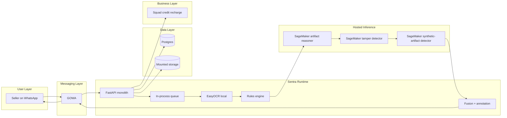
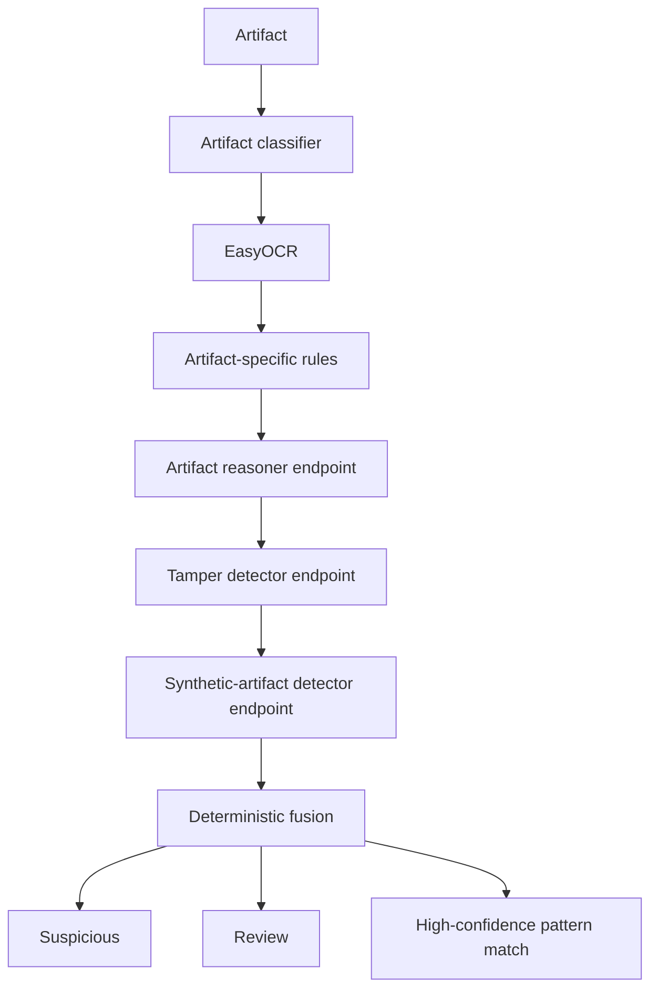
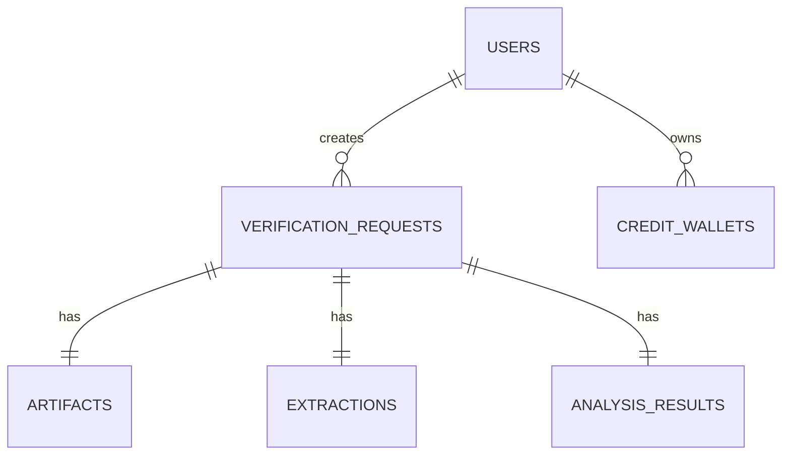

# Sentra

Sentra is a WhatsApp-first fraud risk detector for proof-of-payment artifacts used by small online sellers and Instagram/WhatsApp vendors in Nigeria. It screens bank alert screenshots, SMS alert screenshots, payment receipt screenshots, receipt PDFs, and AI-generated or synthetic proof artifacts before goods are released.

## Why this exists

Challenge 01 requires an AI system that verifies or trust-scores fraud-prone artifacts, produces interpretable outputs, handles forged or incomplete inputs, and integrates Squad meaningfully. Social commerce in Nigeria often closes sales inside chat, where sellers must make release decisions from low-trust screenshots and receipts. Sentra targets that exact failure point.

## Product boundary

- Sentra is a **fraud risk detector**
- Sentra is **not** a bank-settlement verifier
- Sentra does **not** claim a proof is legally genuine or fake
- Sentra returns only:
  - `Suspicious`
  - `Review`
  - `High-confidence pattern match`

## User flow

```mermaid
flowchart LR
  A[Seller sends screenshot or PDF on WhatsApp] --> B[GOWA webhook]
  B --> C[FastAPI ingest]
  C --> D[Persist request + artifact]
  D --> E[In-process worker]
  E --> F[Artifact classification]
  F --> G[EasyOCR + normalized fields]
  G --> H[Rules engine]
  H --> I[SageMaker artifact reasoner]
  I --> J[SageMaker tamper detector]
  J --> K[SageMaker synthetic-artifact detector]
  K --> L[Deterministic fusion]
  L --> M[Annotated preview + action]
  M --> N[GOWA sends result back to seller]
```



## Full architecture

The editable Excalidraw source lives at `assets/diagrams/sentra-system.excalidraw`.



## Runtime architecture

- `FastAPI` orchestrates ingestion, persistence, OCR, rules, fusion, annotation, and messaging
- `GOWA` handles inbound and outbound WhatsApp traffic
- `Postgres` stores users, verification requests, artifacts, extractions, analysis results, and credit wallets
- `Mounted storage` stores uploads, rendered files, and annotated outputs
- `EasyOCR` runs locally
- hosted artifact reasoner runs on SageMaker for artifact-aware reasoning
- hosted tamper detector runs on SageMaker for tamper analysis and suspicious-region support
- hosted synthetic-artifact detector runs on SageMaker for AI-generated or synthetic proof detection
- `Squad` is used for credit recharge payments

## Input contract

- supported file types:
  - `image/jpeg`
  - `image/png`
  - `application/pdf`
- file size limit:
  - about `10 MB`
- PDF scope:
  - first page only
- multi-file messages:
  - first supported file only
- interaction model:
  - single-turn
  - upload-first
  - no follow-up prompts in WhatsApp

## Output contract

Every response returns:

- verdict
- artifact type
- extracted fields
- top reasons
- recommended action
- annotated preview when available

Example shape:

```json
{
  "request_id": 42,
  "artifact_type": "bank_alert_screenshot",
  "verdict": "Suspicious",
  "recommended_action": "Do not release goods yet. Request another proof or confirm payment through a safer channel.",
  "extracted_fields": {
    "amount": "Not detected",
    "currency": "NGN",
    "date": "Not detected",
    "time": "Not detected",
    "reference": "Not detected",
    "provider": "Not detected",
    "recipient_label": "Not detected"
  },
  "reasons": [
    "The SMS proof is missing a balance-style structural cue.",
    "A clear transaction reference was not detected."
  ],
  "quality_flags": [],
  "annotated_artifact_path": "storage/annotated/42_sample.png",
  "processing_time_ms": 850
}
```

## Verdict semantics

### `Suspicious`

Use when there is strong tamper evidence or severe structural inconsistency.

Recommended action:
- do not release goods yet
- request another proof or confirm through a safer channel

### `Review`

Use when the upload quality is poor, the format is ambiguous, or the system cannot assess confidently.

Recommended action:
- do not rely on this proof alone
- ask for a clearer screenshot or original receipt document

### `High-confidence pattern match`

Use when the artifact matches known proof patterns and no major anomaly signals are found.

Recommended action:
- proceed at your discretion

## ML and pipeline design

The application implements a multi-branch verification pipeline with artifact classification, OCR, structural reasoning, tamper analysis, synthetic-artifact detection, and deterministic fusion.

### Models

- `microsoft/dit-base`
  - artifact classification across bank alert screenshots, SMS alert screenshots, receipt screenshots, and rendered PDF receipts
- `microsoft/layoutlmv3-base`
  - structural trust classification using image, text, and layout signals
- `TruFor`
  - tamper localization and manipulation signal extraction
- `TrOCR`
  - OCR baseline for document and payment-proof text extraction
- `Sumsub/Sumsub-ffs-synthetic-2.0`
  - AI-generated or synthetic proof detection

### Datasets

- `CORD`
  - receipt structure and field layout supervision
- `SROIE`
  - receipt OCR and key information extraction support
- `Find it Again!`
  - forged receipt supervision
- `DocTamper`
  - document tampering supervision
- local anonymized Nigerian proof references
  - bank alert screenshots
  - SMS alert screenshots
  - payment receipt screenshots
  - receipt PDFs rendered to image
- synthetic tampered samples derived from local and public artifacts
  - amount edits
  - date/time edits
  - reference edits
  - compression and crop variants
  - region-level replacements

### Decision logic



## Folder structure

```text
.
├── app
│   ├── api
│   │   └── routes
│   ├── core
│   ├── db
│   ├── inference
│   ├── integrations
│   ├── models
│   ├── schemas
│   ├── services
│   └── workers
├── assets
│   └── diagrams
├── ml
│   ├── datasets
│   ├── evaluation
│   └── training
├── scripts
│   ├── generate_synthetic
│   └── prepare_data
├── storage
│   ├── annotated
│   ├── rendered
│   └── uploads
├── tests
├── docker-compose.yml
├── Dockerfile
├── pyproject.toml
└── README.md
```

## Key modules

### `app/api/routes`

- `health.py`
  - `/health`
  - `/ready`
- `dev.py`
  - internal upload endpoint
  - request result inspection endpoint
- `webhooks.py`
  - GOWA inbound webhook

### `app/inference`

- `artifact_classifier.py`
  - artifact type routing
- `ocr.py`
  - OCR integration
- `quality.py`
  - quality flags
- `rules.py`
  - artifact-specific deterministic checks
- `sagemaker_runtime.py`
  - generic model-role endpoint clients
- `fusion.py`
  - final verdict mapping
- `annotate.py`
  - preview generation
- `pipeline.py`
  - full orchestration path

### `app/integrations`

- `gowa.py`
  - send/receive WhatsApp messages and files
  - GoWA basic-auth + device-ID integration
- `sagemaker.py`
  - invoke hosted inference
- `squad.py`
  - credit recharge payment setup

### `ml`

- `ml/datasets/catalog.py`
  - named datasets used by the system
- `ml/training/train_artifact_classifier.py`
- `ml/training/train_trust_classifier.py`
- `ml/training/train_trufor_adapter.py`
- `ml/evaluation/evaluate_pipeline.py`

## Database model



Core entities:

- `users`
- `verification_requests`
- `artifacts`
- `extractions`
- `analysis_results`
- `credit_wallets`

## GOWA integration

Sentra expects GOWA to:

- forward inbound media events to `POST /api/webhooks/gowa`
- expose media download URLs
- accept outbound text messages
- accept outbound file messages

The codebase includes:

- a webhook route
- a GOWA client
- a message renderer

Configured environment:

- `GOWA_BASE_URL`
- `GOWA_BASIC_AUTH_USER`
- `GOWA_BASIC_AUTH_PASSWORD`
- `GOWA_DEVICE_ID`

GoWA deployment assumptions:

- basic auth is configured through `APP_BASIC_AUTH`
- device routing is handled through `X-Device-Id`
- persistent WhatsApp state is stored through `DB_URI`
- webhook delivery uses `WHATSAPP_WEBHOOK`

## SageMaker integration

Sentra expects three endpoints:

- `MODEL_ARTIFACT_REASONER_ENDPOINT`
- `MODEL_TAMPER_DETECTOR_ENDPOINT`
- `MODEL_SYNTHETIC_ARTIFACT_DETECTOR_ENDPOINT`

Runtime behavior:

- FastAPI sends structured JSON payloads to SageMaker
- SageMaker returns hosted inference results
- FastAPI fuses them with OCR and rules

Readiness can optionally require SageMaker endpoint configuration with:

- `READINESS_REQUIRE_SAGEMAKER=true`


## Squad integration

Squad is used for credit recharge payments.

Current scope:

- create recharge checkout for credit packs
- verify successful recharge transactions through payment events
- persist wallet balance and recharge references
- model pay-per-verification usage

## Local development

### 1. Install

```bash
python -m venv .venv
.venv\\Scripts\\activate
pip install -r requirements.txt
```

### 2. Configure

Create `.env` from `.env.example` and set the required values.

Set:

- `GOWA_BASIC_AUTH_USER`
- `GOWA_BASIC_AUTH_PASSWORD`
- `GOWA_DEVICE_ID`
- `AWS_REGION`
- `MODEL_ARTIFACT_REASONER_ENDPOINT`
- `MODEL_TAMPER_DETECTOR_ENDPOINT`
- `MODEL_SYNTHETIC_ARTIFACT_DETECTOR_ENDPOINT`
- `AWS_ACCESS_KEY_ID`
- `AWS_SECRET_ACCESS_KEY`
- optional Squad keys

### 3. Run locally

```bash
uvicorn app.main:app --reload
```

### 4. Run with Docker Compose

```bash
docker compose up --build
```

Compose is set up for internal service networking and Dokploy-style deployment:

- `api` exposes `8000` internally
- `gowa` exposes `3000` internally
- `postgres` exposes `5432` internally
- no host port mappings are required in the default stack
- GoWA state is persisted in `./gowa-data`

## Test plan

Automated tests cover:

- fusion label mapping
- readiness response shape
- WhatsApp message rendering
- dev upload endpoint smoke behavior
- SageMaker config presence

There is also a live integration test:

- `tests/test_live_integrations.py`

It only runs when real AWS credentials and endpoint names are present in the environment.

Run tests:

```bash
pytest
```

## Readiness and health

- `GET /health`
  - process liveness
- `GET /ready`
  - database
  - OCR runtime
  - storage
  - optional SageMaker endpoint configuration

## Challenge 01 fit

Sentra aligns with the challenge requirements by:

- targeting a real fraud problem for Nigerian sellers
- using AI for verification and trust scoring
- returning an interpretable verdict plus action
- handling forged, low-quality, and adversarial artifacts
- documenting a research-grade training path in-repo
- integrating Squad through credit-based recharge

## Judge-facing summary

Sentra is a WhatsApp-first fraud risk detector for proof-of-payment artifacts. It helps Nigerian online sellers screen screenshots and receipt documents before releasing goods. The runtime uses OCR plus hosted visual reasoning, tamper analysis, and synthetic-artifact detection, and uses Squad to recharge seller verification credits.
